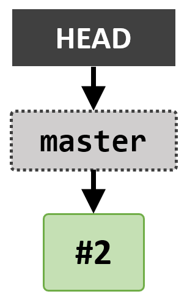
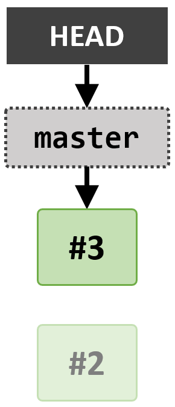
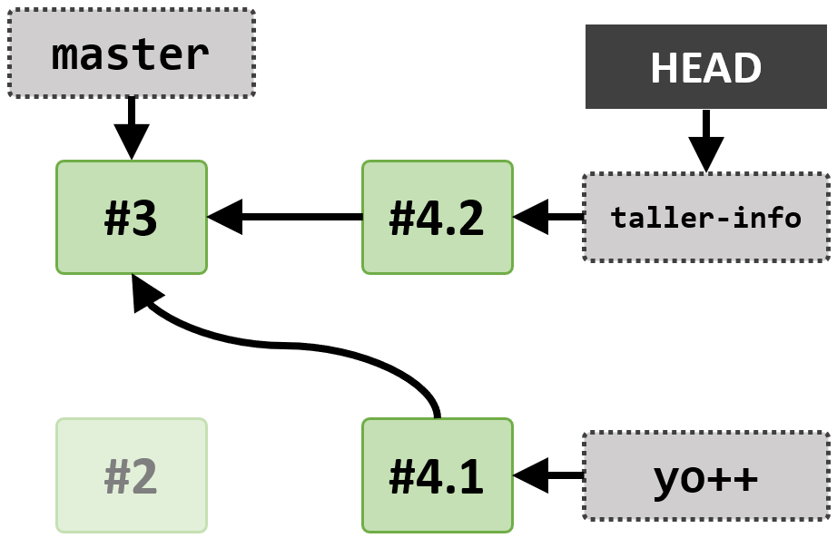
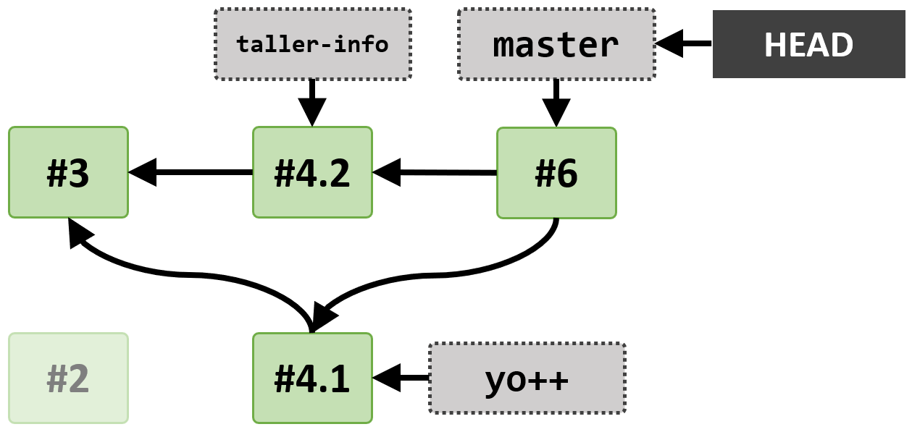
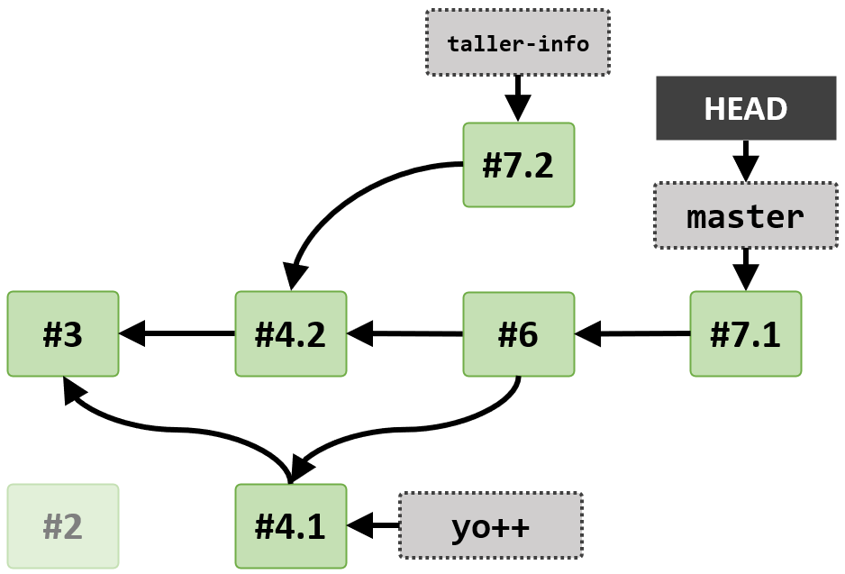
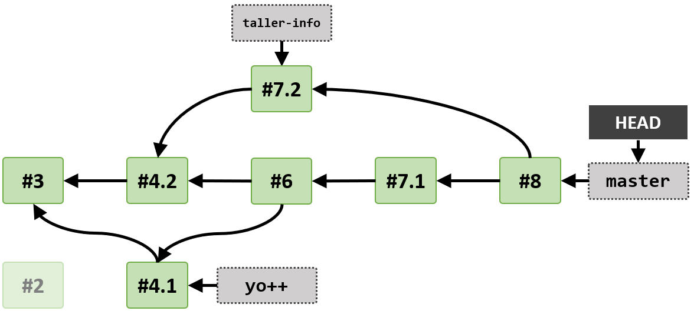

# Introducción a Git y GitHub: Ejercicios

Este repositorio contiene ejercicios para un taller introductorio a Git y GitHub. El taller cubre los contenidos de [Unidad 1].

Cada ejercicio que involucra crear un commit contiene una ilustración de cómo debe verse el árbol de commits del repo al final del ejercicio.

**En las ilustraciones, el número dentro de cada commit hace referencia al ejercicio en el que se creó.**

## #1 Configuración inicial

¡**Configura** tu nombre, correo electrónico y editor de texto!

Ejemplo de configuración:

```bash
git config --global user.name "Jose Ortega"
git config --global user.email joseortega.prof@stemgranada.com
```

Tras la configuración puedes ejecutar `git config --global --list` para ver en la terminal toda tu configuración global.

❓ ¿Para qué sirve establecer el parámetro --global? ¿Funcionaría si no lo ponemos?

## #2 Primer repositorio local

Crea un nuevo repositorio en un directorio llamado `git-workshop`.

Crea los archivos `README.md` y `Jose.txt`. Actualmente los archivos no requieren tener contenido.

Agrega esos dos archivos al staging area y realiza el **primer commit** del repo.

<p align="center">
  
</p>

```
(Podemos crear los directorios y los ficheros usando windows, no tiene que ser desde la terminal)
mkdir git-workshop
cd git-workshop
git init
touch README.md Jose.txt    # Crear los archivos en Linux
echo. > README.md           # Crear el archivo README.md (Windows)
echo. > Jose.txt            # Crear el archivo Jose.txt (Windows)
git add README.md Jose.txt
git commit -m "Primer commit: Agrega README.md y Jose.txt"
```

## #3 Correcciones básicas

¿Tu nombre no es Jose? Vamos a cambiar el nombre del archivo Hernán.txt para que coincida con el tuyo.

De tal forma que **reescribas** el commit realizado en el paso anterior, renombra el archivo `Jose.txt` a `<tu-nombre>.txt`, p. ej. `Pablo.txt` o `Teresa.txt`.

<p align="center">
  
</p>

```
git mv Jose.txt <tu-nombre>.txt  # Reemplaza <tu-nombre> por tu nombre real
git commit --amend -m "Renombra Jose.txt a <tu-nombre>.txt"
```

Al usar git `commit --amend`, se reescribe el commit anterior, incluyendo el cambio de nombre. Eso era lo que pedía el ejercicio exactamente. Pero también se puede hacer eliminando el archivo antiguo (Jose.txt), añadiendo el nuevo y haciendo un commit.

```
git rm Jose.txt
git add <tu-nombre>.txt
git commit -m "Se elimina el fichero antiguo y se añade el nuevo"
```

## #4 Crear ramas

Crea la rama `yo++` y cámbiate a esa rama. Ahora que estás en la rama `yo++`, escriba una o dos oraciones acerca de ti en el archivo `.txt` con tu nombre.

Cuando hayas concluido de redactar, agrega tus cambios al staging area y realiza un commit.

```
git checkout -b yo++
Edita el documento <tu-nombre>.txt como creas conveniente -> "Una pequeña descripción sobre mí."
git add <tu-nombre>.txt
git commit -m "Añade descripción personal en <tu-nombre>.txt"
```

Ahora regresa al primer commit del repo usando `git checkout master`. Crea otra rama: `taller-info`, y cámbiate a la rama. En el `README.md`, escribe una o dos oraciones acerca del taller, agrega los cambios al staging area y realiza un commit.

```
git checkout master
git checkout -b taller-info
Edita el documento README.md como creas conveniente
git add README.md
git commit -m "Añade descripción del taller en README.md"
```

<p align="center">
  
</p>


| ℹ | Inspecciona el estado actual del repositorio con:<br> `git log --oneline --all --graph`<br>Observa que el repo ahora contiene tres commits, uno apuntado por `master`, otro por `taller-info` y el tercero apuntado por `yo++`.
|---|---|

❓ ¿Desde la rama `taller-info`, el archivo `.txt` con tu nombre tiene contenido o está vacío? ¿Por qué crees que es así?

## #5 Merge fast-forward de ramas

Colócate en la rama `master`, e incorpora los cambios de `yo++` a `master` mediante un merge.

```
git checkout master
git merge yo++
```

## #6 Merge recursive de ramas

Ahora, permaneciendo en `master` incorpora los cambios de `taller-info` en `master` mediante un merge.

```
git merge taller-info
```

<p align="center">
  
</p>

## #7 Aparición de conflictos al realizar merge

En `master`, modifica la primera línea del archivo `README.md`, agrega los cambios al staging area y realiza un commit.

```
git checkout master
Modifica el archivo README.md
git add README.md
git commit -m "Cambia README desde master"
```

Ahora colócate en la rama `taller-info`, modifica la primera línea de `README.md` (de manera distinta a como la modificaste previamente), agrega los cambios al staging area y realiza un commit.

```
git checkout taller-info
Modifica el archivo README.md
git add README.md
git commit -m "Cambia README desde taller-info"
```

Regresa a `master`, e incorpora los cambios de `taller-info` mediante un merge. Git te debería reportar que ha ocurrido un conflicto que requiere ser solucionado manualmente.

```
git checkout master
git merge taller-info
```

<p align="center">
  
</p>

❓ ¿Por qué ocurrió un conflicto en este caso?


## #8 Resolución de conflictos de merge

En tu editor de texto preferido, abre el archivo con el conflicto (`README.md`), elimina los marcadores de conflicto y edita el contenido de acuerdo a cómo deseas preservar el archivo.

Una vez terminada la edición en el editor de texto, agrega los cambios al staging area y ejecuta `git merge --continue` o como se indica en vuestro manual, puedes hacer simplemente un nuevo commit con `git commit -m "Resolución del conflicto"`.

```
git add README.md
git commit -m "Resolución del conflicto en README.md"
```

<p align="center">
  
</p>

## #9 Primer repositorio de GitHub

Crea un repositorio público en GitHub, con el nombre de `<tu-nombre>-intro-git`, p. ej. `pablo-intro-git`.

❓ ¿Cómo o en qué es GitHub diferente a Git?

## #10 Sube tus cambios a GitHub

Empuja (push) los cambios de tu rama `master` a GitHub, para que los demás también puedan ver tu repo.

```
git remote add origin https://github.com/<tu-usuario>/tu-repositorio
git push -u origin master
```

❓ Tras realizar push de `master`, ¿puedes también ver en GitHub tus ramas `taller-info` y `yo++`?

